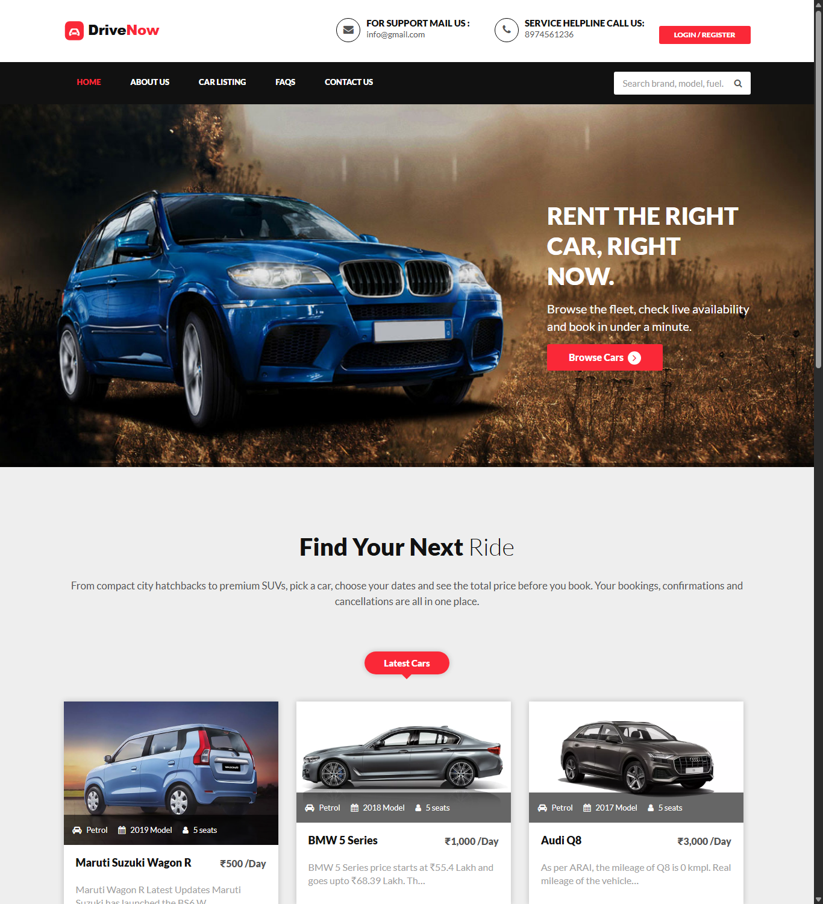
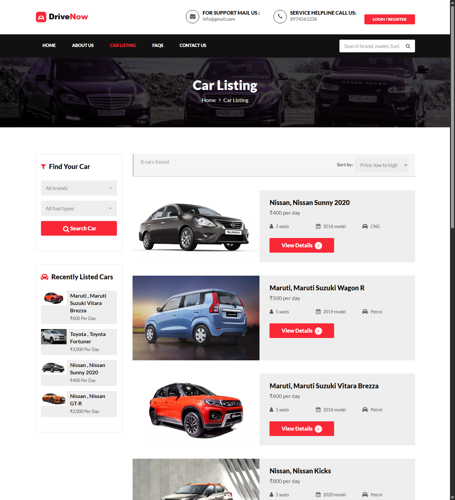
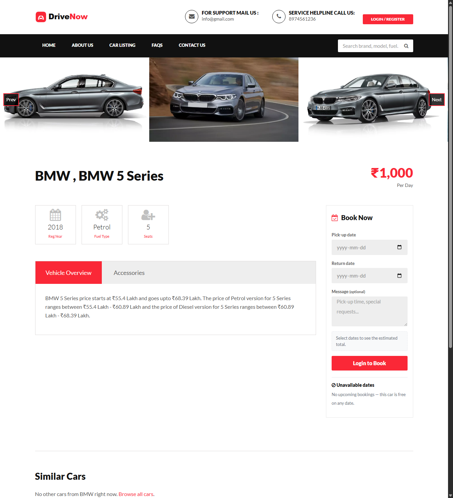
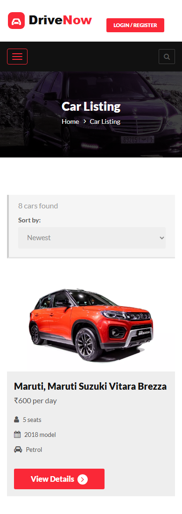
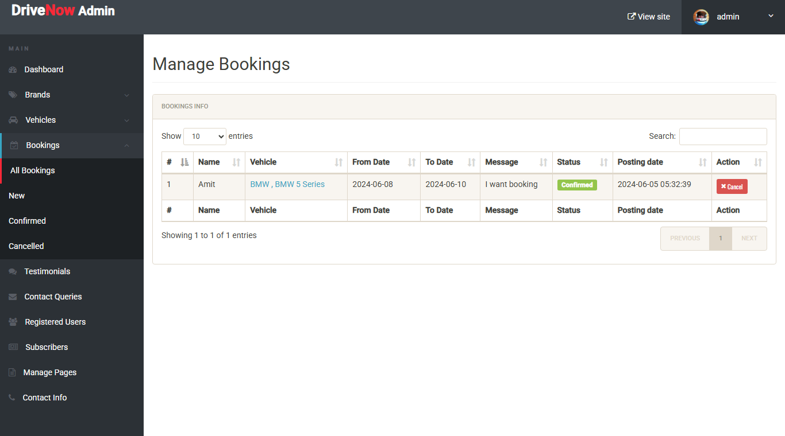

# DriveNow: Car Rental & Booking Portal

[](https://github.com/Darshil999/Drive-Now/actions/workflows/ci.yml)

DriveNow is a full-stack car rental web app. Customers can browse the fleet, check live availability, see the price before booking, and manage their own bookings. Admins manage vehicles, brands, bookings, and site content from a separate dashboard.

Built with **PHP 8 (PDO)**, **MySQL/MariaDB**, **Bootstrap 3** and **jQuery**. It has no framework, so the request handling, validation, auth, and SQL are all written by hand and easy to read.



---

## Features

### For customers
- **Accounts**: sign up, log in, and log out, plus a profile page and a password change page. Passwords are hashed with bcrypt.
- **Forgot password**: you request a reset link by email. The link works once and expires after 30 minutes (see [Password reset](#password-reset)).
- **Browse & search**: filter cars by brand and fuel type, search by keyword (model, brand, fuel, or year), and sort by price or model year. The filters live in the URL, so a result page can be bookmarked or shared.
- **Booking flow**:
  - Date pickers block past dates, and the price estimate (days × daily rate) updates live as dates change.
  - Each vehicle page lists the dates already taken.
  - The server checks every booking: you must be logged in, dates must be valid, the car can't be double-booked, and a booking can be at most 30 days.
  - Bookings are saved inside a **transaction with a row lock**, so two people booking the same car at the same moment can't both succeed.
- **My Bookings**: bookings appear under All, Upcoming, Past, and Cancelled tabs, each with a status badge and an invoice. You can **cancel a booking yourself** any time before the pick-up date.
- **Testimonials & contact**: post a testimonial (shown on the site after an admin approves it) and send a message through the contact form.
- **Responsive** layout from phones to desktops.

### For admins (`/admin`)
- A dashboard with counts of users, vehicles, bookings, and queries.
- **Vehicles**: add, edit, delete, and replace images. Uploads are validated.
- **Brands**: add, edit, and delete. A brand that still has cars can't be deleted.
- **Bookings**: review, confirm, or cancel. A booking can't be confirmed if it overlaps another confirmed booking for the same car.
- Moderate testimonials, read contact queries, manage newsletter subscribers, and edit the CMS pages (About, FAQ, Terms, Privacy).

### Security & reliability
| Area | What's in place |
|---|---|
| Passwords | `password_hash` (bcrypt). Old MD5 hashes are upgraded automatically the next time that user logs in. |
| SQL injection | Every query is a prepared statement. Sort columns come from a fixed whitelist. |
| XSS | All output is escaped with an `e()` helper. |
| CSRF | Every state-changing request is a POST that carries a session token, including admin confirm/cancel/delete/approve. No GET request changes data. |
| Password reset | The link holds a 256-bit random token. Only its SHA-256 hash is stored. The link expires after 30 minutes, works once, and is replaced if you request a new one. Requests are throttled to one per minute, and the response is the same whether or not the email exists. |
| Sessions | Cookies are `HttpOnly` and `SameSite=Lax`, and the session ID is regenerated at login. |
| File uploads | The image type is checked from the file's contents (not its extension), size is capped at 5 MB, and files get random names. The upload folder refuses to run scripts (`.htaccess`). |
| Data integrity | Booking dates are `DATE` columns. Unique keys cover user email, booking number, and subscriber email. Tables use utf8mb4 on InnoDB. |
| Errors | Database errors are logged, never shown to visitors. |

---

## Tech stack

| Layer | Technology |
|---|---|
| Backend | PHP 8.x, PDO (MySQL driver) |
| Database | MySQL 8 / MariaDB 10.4+ |
| Frontend | HTML5, Bootstrap 3, jQuery, Font Awesome, Owl Carousel / Slick |
| Dev environment | XAMPP **or** Docker Compose (Apache + PHP 8.2 + MySQL 8) |

---

## Getting started

### Option A: Docker (one command)

```bash
docker compose up -d --build
```

Then open **http://localhost:8080**. On first start, the database is created from `SQL File/carrental.sql`. To reset it to the demo data, run `docker compose down -v`.

### Option B: XAMPP / WAMP / MAMP

1. Copy the `carrental` folder into your web root (for XAMPP, that's `C:\xampp\htdocs\carrental`).
2. Start **Apache** and **MySQL** from the XAMPP control panel.
3. Open **http://localhost/phpmyadmin**, create a database named `carrental`, and import `SQL File/carrental.sql`.
4. Visit **http://localhost/carrental**.

The defaults match a stock XAMPP install (user `root`, no password). If your setup differs, set the environment variables below (for example with `SetEnv` in Apache), or change the fallback values at the top of `carrental/includes/bootstrap.php`.

| Variable | Default | Purpose |
|---|---|---|
| `DB_HOST` | `localhost` | MySQL host |
| `DB_NAME` | `carrental` | Database name |
| `DB_USER` | `root` | Database user |
| `DB_PASS` | *(empty)* | Database password |
| `APP_CURRENCY` | `₹` | Currency symbol shown with prices |
| `APP_DEBUG` | *(off)* | Set to `1` to show PHP and database errors while developing |
| `APP_URL` | *(request host)* | Public base URL used in emailed links, e.g. `https://drivenow.example.com`. **Set this in production** so links can't be redirected through a forged `Host` header. |
| `MAIL_DRIVER` | `log` | `log` writes emails to `MAIL_OUTBOX` (for local and demo use). `mail` sends them with PHP `mail()`. |
| `MAIL_OUTBOX` | `carrental/storage/outbox.log` | Where `log` mode writes emails. The `storage/` folder is blocked from the web. |

> **Already imported an older dump?** Run the files in `SQL File/migrations/` in order, each once, instead of re-importing. `001` adds the date columns, indexes, and charset. `002` adds the password-reset table. Your data is kept.

### Demo accounts

| Role | Login | Password |
|---|---|---|
| Admin (`/admin`) | `admin` | `Test@12345` |
| Customer | `test@gmail.com` | `Test@123` |
| Customer | `amikt12@gmail.com` | `Test@123` |

Change these before deploying anywhere public.

### Password reset

1. Click **Login / Register**, then **Forgot password?**, and enter the account's email.
2. In the default demo mode (`MAIL_DRIVER=log`), the email is written to **`carrental/storage/outbox.log`**. Open the link inside it.
3. Choose a new password. The link now stops working, and a new request makes any older link invalid.

To send real email, set `MAIL_DRIVER=mail` and `APP_URL`. This needs a working `sendmail`/SMTP setup in PHP.

---

## Running the tests

The PHPUnit suite has two parts:
- **Unit tests** cover password hashing and rules, CSRF tokens, and booking-date validation. They need no database.
- **Integration tests** cover login and legacy-hash upgrade, the password-reset token lifecycle, booking overlap rules, customer and admin cancel/confirm, and row-lock behaviour under concurrent bookings. They run against MySQL.

The integration tests create their own `carrental_test` database from `SQL File/carrental.sql`, so your demo data is never touched.

```bash
# With Docker (no local PHP needed)
docker compose run --rm tests

# Or locally: PHP 8.1+, Composer, and a MySQL server you can create databases on
composer install
TEST_DB_HOST=127.0.0.1 TEST_DB_USER=root TEST_DB_PASS= vendor/bin/phpunit
```

Without a reachable MySQL server the integration tests are skipped, unless `REQUIRE_DB_TESTS=1` is set, in which case they fail. **CI** (`.github/workflows/ci.yml`) runs on every push and pull request: it lints every PHP file, then runs the full suite against a MySQL 8 service container with `REQUIRE_DB_TESTS=1`.

---

## Project structure

```
Drive-Now/
├── carrental/                    # Web root
│   ├── includes/
│   │   ├── bootstrap.php         # DB connection, session, CSRF check (shared with admin)
│   │   ├── functions.php         # Constants + helpers: escaping, flash, CSRF, passwords, mail, uploads
│   │   ├── auth.php              # Login, legacy-hash upgrade, password-reset tokens
│   │   ├── bookings.php          # Booking rules: validation, overlap, create, cancel, confirm
│   │   ├── config.php            # Public-site entry: bootstrap + shared form handlers
│   │   ├── form-handlers.php     # Login / sign-up / reset request / newsletter (POST → redirect)
│   │   ├── header.php, footer.php, sidebar.php
│   │   └── login.php, registration.php, forgotpassword.php   # Modal markup
│   ├── index.php                 # Home: latest cars, live stats, testimonials
│   ├── car-listing.php           # Browse, filter, search, sort
│   ├── vehical-details.php       # Vehicle page + booking (transactional)
│   ├── my-booking.php            # Customer bookings + self-service cancel
│   ├── profile.php, update-password.php, post-testimonial.php, my-testimonials.php
│   ├── contact-us.php, page.php  # Contact form, CMS pages
│   ├── reset-password.php        # Opened from the emailed link: set a new password
│   ├── check_availability.php    # JSON: is this email free to register?
│   ├── storage/                  # Demo mail outbox (blocked from the web)
│   ├── assets/
│   │   ├── css/drivenow.css      # Project styles on top of the base theme
│   │   └── js/booking.js         # Live price estimate + date guards
│   └── admin/
│       ├── includes/config.php   # Admin entry (reuses bootstrap.php) + action_button() POST helper
│       ├── includes/booking-actions.php  # Confirm/cancel handler (uses bookings.php)
│       ├── css/drivenow-admin.css        # Shared admin styles
│       ├── dashboard.php, manage-*.php, post-avehical.php, edit-vehicle.php, ...
│       └── img/vehicleimages/    # Uploaded vehicle photos (scripts blocked)
├── SQL File/
│   ├── carrental.sql             # Schema + demo data
│   └── migrations/               # Upgrades for existing databases
├── tests/
│   ├── Unit/                     # Passwords, CSRF, booking-date validation
│   └── Integration/              # Auth, password reset, booking/overlap rules (MySQL)
├── .github/workflows/ci.yml      # Lint + PHPUnit on every push / PR
├── composer.json, phpunit.xml
├── docker/                       # Dockerfile + php.ini for local dev and tests
├── docker-compose.yml
└── docs/screenshots/
```

### How a request flows

```
Browser ──► page.php
             │  include includes/config.php
             │     ├─ bootstrap.php: connect PDO, start session, verify CSRF on POST
             │     └─ form-handlers.php: handle login/sign-up/etc. → flash message → redirect
             │  page-specific POST handler (validate → write → flash → redirect)
             └─ render HTML (header shows flash messages; every value goes through e())
```

Every form follows **Post/Redirect/Get**: the handler validates the input, writes to the database, stores a one-time "flash" message in the session, and redirects. Refreshing the page therefore never submits the form twice, and messages appear as Bootstrap alerts instead of JavaScript `alert()` popups.

### Booking rules (`includes/bookings.php`)
1. The user must be logged in. Dates must be real `YYYY-MM-DD` values, the pick-up date can't be in the past, the return date must be on or after the pick-up date, and the booking can last at most 30 days.
2. `BEGIN`, then `SELECT … FOR UPDATE` on the vehicle row. This makes concurrent bookings for the same car wait in line.
3. Overlap check: `FromDate <= :to AND ToDate >= :from`. Cancelled bookings are ignored.
4. Insert with a unique booking number, then `COMMIT`.
5. Days are counted inclusively (pick-up and return day both count), so the customer page and the admin invoice always show the same total.

---

## Screenshots

| Home | Car listing |
|---|---|
|  |  |

| Vehicle details & booking | Mobile |
|---|---|
|  |  |

**Admin: manage bookings**



---

## Manual test checklist

1. **Sign up** with a weak password or a 9-digit mobile number. You should see an error. Then sign up with valid details; you're logged in automatically.
2. **Search** for `nissan` in the header search box. Filter by **Fuel: CNG** and sort by **price: low to high**.
3. Open a car and pick dates. The estimated total updates as you change them. Click **Book Now**. You land on **My Bookings** with a success message.
4. Try to book the **same car for overlapping dates**. You should see an error. Its dates also appear under **Unavailable dates**.
5. **Cancel** the booking from My Bookings. Those dates become free again.
6. Log in to **/admin** and confirm a booking. Try deleting a brand that still has cars; it's refused.
7. In **admin → Vehicles → change image**, upload a `.php` file renamed to `.jpg`. It's rejected.
8. Use **Forgot password?**, open the link from `carrental/storage/outbox.log`, and set a new password. Opening the same link again shows it is no longer valid.

---

## Possible next steps
- Real email delivery (PHPMailer + SMTP) and email verification at sign-up
- Login rate limiting / lockout after repeated failures
- Payment gateway integration (Razorpay or Stripe test mode)
- Upgrade the UI from Bootstrap 3 to Bootstrap 5
